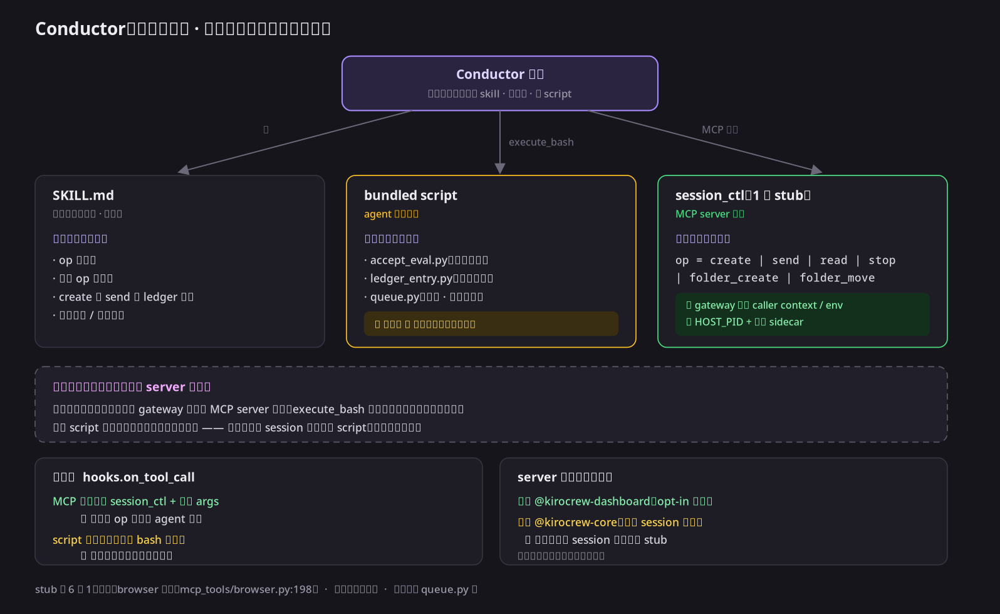

# RFC: Conductor control surface — one op-shaped tool, and where a script may not go

Status: partial. The op-shaped surface and `queue.py` are both implemented (see
Implementation below); gateway-side dispatch, which is what would make a duplicate
dispatch impossible rather than merely detectable, is not. The diagram and the
division of labour are the part to read first — everything else follows from them.

## Why this exists

Two questions kept recurring while working on `kirocrew-conductor`, and both
have the same answer:

1. Can the conductor's session-control work move out of MCP and into bundled
   scripts, the way acceptance judgement already did (`accept_eval.py`,
   `ledger_entry.py`)? Scripts are deterministic, and they cost no tool stub.
2. If not, can the *stub cost* still come down — the conductor currently
   mounts eight separate dashboard tools (four folder verbs, four session
   verbs) to do what is really two jobs?

The answer is **no to (1) for anything identity-bound, yes to (2)** — and the
reason for both is a single boundary that is easy to miss because it does not
follow the module structure. This RFC names it once so the next person does not
re-derive it.

## The boundary



Three owners, one executor:

| Owner | Runs where | Owns |
|---|---|---|
| `SKILL.md` | nowhere — it is text the model reads | **Sequence and vocabulary**: the op list, each op's parameters, the `create → send → ledger` order, stop conditions, patrol cadence |
| bundled script | a child process of `execute_bash` | **Verdicts and formats**: `accept_eval.py`, `ledger_entry.py`, and a future `queue.py` |
| MCP tool | the MCP server process | **Identity and authorization**: which session the caller *is*, and whether this op is permitted |

The model is the only executor. It reads the skill, runs the scripts, and calls
the tools; none of the three calls each other.

**The line that decides the split is the process boundary, not which module or
which MCP server a capability lives in.** Every identity source the strict
resolver accepts is injected by the gateway into the *MCP server process*:

- the per-call caller context gatewayd authors on each inbound frame,
- the `KIROCREW_SESSION_KEY` env var,
- `KIROCREW_HOST_PID` plus the HMAC sidecar signed with the SEL trust root
  (the bare `session_pid_<pid>.txt` is agent-writable and therefore forgeable;
  the signature is the half that counts).

A child of `execute_bash` has none of the first two — measured, not assumed: in
a live dashboard session `KIROCREW_SESSION_KEY` is absent from that child while
`KIROCREW_HOST_PID` is present. So a script can only ever *assert* which
session it is, and the endpoint has no way to check the assertion. That is
precisely what session control refuses: `mcp_dashboard.py` gates on
`_resolve_session_key_strict()` and the comment there names the failure mode —
the lenient `/proc` ancestor walk hands a subagent its *parent's* identity, and
with it the ability to read, message, or stop the parent's sibling sessions.

This is why "move the MCP calls into a script" cannot be made safe by adding a
keystone leaf. A leaf gates **whether** the script may run; it cannot constrain
**which session** the script names.

## What changes: eight stubs become two op-shaped tools

```
session_ctl(op = create | send | read | stop,             args = { … })
chat_folder_ctl(op = tree | create | move | move_session, args = { … })
```

The handlers stay in the MCP server process, so `_resolve_session_key_strict()`
keeps running exactly where it runs today. Nothing about the security model
moves. The op bodies are not rewritten: each remains the same endpoint call
validated by the same per-op schema, so this is a surface change.

There is direct precedent in the repo: the `browser` tool is one stub with an
`op` enum and a free-form `args` object covering thirteen browser actions
(`src/kiro_crew/mcp_tools/browser.py:198`).

### Why two tools and not one

Collapsing all eight into a single tool looked cleaner and is wrong. Channel
containment (`channel.CHANNEL_AGENT_BLOCKED_TOOLS`) matches on the **tool
name**, against rendered permission-request text — it never sees an `op`. One
merged name would therefore make that block all-or-nothing: either a channel
agent regains session control (the exact regression the old per-site tool list
already caused once, where `session_create` was identity-gated but reachable
from a channel agent) or it loses the folder organization it has today.
Splitting on the capability class keeps the block exact and still removes six of
the eight stubs.

Two consequences follow, and both are implemented rather than left to prose:

- The caller-identity gate must run on the **resolved** op, not the op-shaped
  name. Gating on `session_ctl` would gate folder work too; gating before
  translation would leave every session op ungated. The gate's own list is
  *derived* from the op→handler map (`SESSION_CONTROL_INNER`), so an op added
  later is identity-gated the moment it is mapped — that derivation replaces the
  hand-copied list whose per-site drift caused the earlier regression.
- The advertised enum, the op→handler map, and the refusal text for an unknown
  op all read the same two tuples, so an op cannot be half-added.

## Why this beats the current design

**1. The stub surface drops 8 → 2 — measured at −35%, not −75%.** `tools/list` is
read once per session, so the serialized descriptor list IS the standing cost for
that whole session, whether or not the capability is used. Measured on the real
`_tool_definitions()` output, before and after:

| | tools | `tools/list` payload | ≈ tokens |
|---|---|---|---|
| before | 8 | 6,956 B | ~1,930 |
| after | 2 | 4,523 B | ~1,260 |
| delta | −6 | **−2,433 B (−35%)** | **~−676** |

The count fell 75% and the cost fell 35%, and the gap is deliberate: the two
descriptions keep enough per-op detail to be driven by an agent that carries no
conductor skill, because this set is granted to agents that have none. Anyone
reading "six of eight stubs go away" as a 75% saving is reading it wrong — the
saving is ~676 tokens per session that mounts this server. The op vocabulary that
did move out lives in `SKILL.md`, loaded on demand rather than declared always.

**2. It keeps the authorization gate that the script route destroys.** This is
the decisive advantage, and it is easy to overlook. `@kirocrew-dashboard` is
deliberately *not* in the conductor's `allowedTools` — the comment in
`_install_conductor_agent` says why: those calls must keep passing through
`hooks.on_tool_call`, where the deny floor and the governance ceiling apply
with the *real arguments*. Under `session_ctl` the gate still sees a tool call
with real args, so it can inspect `op` and the target and apply per-op rules —
including the agent-scope allowlist (`capabilities.spawn.scopes.agents`) on a
`create`. Under a script the gate sees one `execute_bash python3 dispatch.py`
and the arguments are inside the process, invisible. So the op shape gets the
stub reduction that motivated the script idea *without* trading away a live
authorization check.

**3. Ordering lands where ordering belongs.** Today the sequence
(`create` → `send` → record the ledger row) is spread across six tool
descriptions plus prose in the skill. With one tool the descriptions cannot
carry it, so it lives in exactly one place: the skill. That is what a skill is
for, and it is the same reason `ledger_entry.py` exists — a contract that was
prose plus a worked example produced two real defects in review.

**4. It does not disturb what already works.** Acceptance stays deterministic
in `accept_eval.py`; ledger entries stay in `ledger_entry.py`; identity and
authorization stay in the MCP server process. The change is confined to the
tool surface.

## What this does NOT fix

**Idempotent dispatch remains a prompt convention.** `create` and `send` are
still two separate calls, so a lost turn between them still leaves a session
with no seed — the failure the skill currently guards with "send the seed
BEFORE recording the ledger row". Collapsing the stubs does not make the pair
atomic.

The fix for that is orthogonal and script-shaped, because it needs no identity:
a `queue.py` owning a durable queue for mid-flight user messages plus a
dispatch record with pre-assigned ids, so a duplicate is *detectable and
convergent*. That is weaker than Crew Mode's guarantee, where code owns both
the record and the spawn (`crew_chat.py`, `_preassigned_id`) and a duplicate is
impossible. Closing the gap fully means moving dispatch into gateway-side code,
which is a new subsystem and out of scope here.

Recommended order: op shape first (small, no security change), `queue.py`
second, gateway-side dispatch only if the detectable-and-convergent guarantee
proves insufficient in practice.

## Alternatives considered and rejected

**Replace the MCP tools with scripts entirely.** Rejected on the boundary
above: the script would have to hold the gateway credential and name its own
session key, converting a verified property into a client assertion, and it
would blind the authorization gate. A variant where the script imports the
package's own strict resolver was also rejected: it would require an
agent-invokable entry point to read the SEL trust root, which is the one thing
the keystone floor exists to prevent — any branch of such a script that echoed
what it read would be a leak.

**Run the conductor inside Crew Mode.** Rejected: Crew Mode's router is a
code-owned, tool-free decision function, and the selected agent runs in the
*topics* — so the conductor would be dispatched as a topic subagent
(`crew_chat.py`, `_dispatch_agent` → `self._subagents.spawn(...)`), not as the
router. That inverts the hierarchy, puts the control plane a level above the
conductor's real work units (the top-level sessions it creates, which the crew
store does not manage), and removes the host for its `monitor_start` patrol
loop, since a subagent ends when its run ends.

**Move `session_ctl` into `@kirocrew-core`.** Rejected, and for a reason
unrelated to identity: core is the surface every session carries. Session
control is something an agent is granted on purpose, so it stays in the
opt-in assignable `@kirocrew-dashboard` set. Server membership affects standing
cost and grantability only — it is not what makes identity resolution work.

## Implementation

Done in this change:

1. `session_ctl` and `chat_folder_ctl` in `mcp_dashboard.py`: the op
   vocabularies (`SESSION_CTL_OPS`, `CHAT_FOLDER_CTL_OPS`), the op→handler map
   (`_OP_TO_INNER`), and `_resolve_op`, which refuses an unknown op by naming
   the valid ones instead of raising. The eight handler bodies are untouched.
2. The caller-identity gate moved behind op resolution and now tests
   `SESSION_CONTROL_INNER`, derived from the op map.
3. The eight descriptors retired. The two replacements keep enough per-op detail
   to be driven by an agent carrying no conductor skill, because this set is
   granted to agents that have none. Both pinned advertised-set ratchets
   updated, plus new cases for op routing, unknown ops, non-object `args`, gate
   ordering, and per-op schema validation.
4. `channel.CHANNEL_AGENT_BLOCKED_TOOLS` now blocks `session_ctl` — one name
   covering four verbs — with matcher cases pinning the rendered forms and
   pinning that `chat_folder_ctl` stays unblocked.
5. Op forms threaded through the `goal-conductor` skill and the conductor's
   system prompt. `@kirocrew-dashboard` stays mounted and stays out of
   `allowedTools`.

6. `queue.py` — the durable inbox and dispatch record, as a bundled script
   beside the evaluator and the codec. Modes `enqueue` / `claim` / `done` /
   `release` park a mid-flight user message until the round boundary and survive a
   turn that dies after claiming; `dispatch_begin` / `dispatch_sent` / `status`
   pre-assign a dispatch id, return the SAME id on a retry, and name the unseeded
   window. It reads no identity, opens no socket, and runs no subprocess — pinned
   by a source ratchet, because that is the property that makes it safe as a
   script rather than a tool.

Not in this change:

7. Gateway-side dispatch. `queue.py` makes a duplicate dispatch **detectable and
   convergent**, not impossible: the `create`/`send` pair are MCP calls the model
   makes, so only moving dispatch into gateway-side code closes the window. Left
   out until the detectable-and-convergent guarantee proves insufficient in
   practice.

## Evidence

| Claim | Source |
|---|---|
| Session control gates on strict caller identity; the `/proc` walk would hand a subagent its parent's identity | `src/kiro_crew/mcp_dashboard.py` (`_resolve_session_key_strict` call site and the comment above it) |
| Ledger tools do the same, to avoid disclosing or overwriting a parent's ledger | `src/kiro_crew/mcp_tools/ledger.py` (`_strict_session_key`) |
| `monitor_start` / `monitor_update` / `autonudge_stop` use strict resolution, no PID walk | `src/kiro_crew/mcp_tools/control.py` |
| The three accepted identity sources and why the bare pid file is not one | `src/kiro_crew/mcp_core.py` (`_resolve_session_key_strict`) |
| One-stub-many-ops precedent | `src/kiro_crew/mcp_tools/browser.py:198` |
| `@kirocrew-dashboard` withheld from `allowedTools` so every call meets the gate with real arguments | `src/kiro_crew/agent.py` (`_install_conductor_agent`) |
| Core is the always-on surface; this set is opt-in and assigned per server | `src/kiro_crew/mcp_dashboard.py` module docstring |
| Crew Mode dispatches the selected agent as a topic subagent, and its router is a code-owned tool-free decision function | `src/kiro_crew/crew_chat.py` (`_dispatch_agent`, `_decide_once`) |
| The tool-call hook receives real arguments, so a per-op rule remains expressible under one tool name | `src/kiro_crew/hooks.py` (`on_tool_call`, `raw_params`) |
| The `tools/list` payload numbers in "Why this beats the current design" | measured from `_tool_definitions()` at `541c0d401^` and `541c0d401` |

One honest limit on the authorization argument: the hook *can* see `op` and the
target, and nothing today actually keys a rule on them. The value is that the op
shape KEEPS that possible, where moving the calls into a script would foreclose
it — not that a per-op rule is already enforced.
