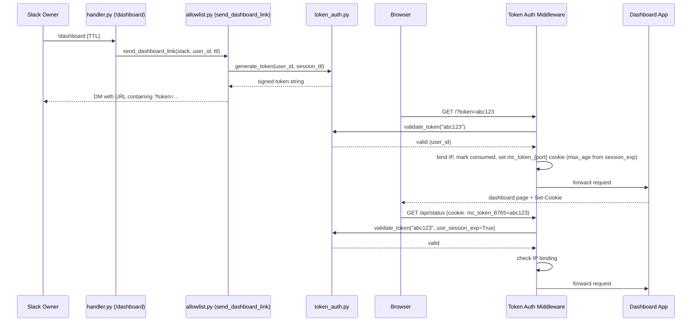
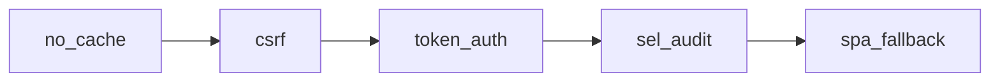

# Dashboard Token Authentication — Design Document

Last Updated: 2026-04-04

## Overview

Slack-gated token authentication for the KiroClaw dashboard. The owner generates a time-limited, HMAC-SHA256 signed URL via the `!dashboard` Slack command. An aiohttp middleware validates the token on every request (query param or cookie fallback), sets a session cookie on first use, and pins the token to the client's IP. Static assets bypass checks. Loopback access (127.0.0.1) is always trusted regardless of mode — this ensures local processes (mcp-core, doctor, SSH tunnels) work without tokens. All generation and validation events are logged to SEL.

Up to 5 tokens can be valid concurrently (FIFO eviction via `OrderedDict` when limit exceeded), allowing multiple browser tabs and CLI sessions without invalidating each other. All token state is managed by a thread-safe `TokenStateManager` and is entirely in-memory — cleared on process restart along with the per-process HMAC secret. Users can explicitly revoke all sessions via `kiroclaw logout`.

## Architecture



Middleware chain (explicit ordering in `server.py`):



1. CSRF checks run first (reject cross-origin mutating requests)
2. Token auth validates identity
3. SEL audit logs the authenticated operation

## Components

### 1. `token_auth.py` — Token Generator, Validator & Middleware

Location: `src/kiro_claw/dashboard/token_auth.py`

#### Token Format

`base64url(payload).base64url(HMAC-SHA256-signature)` where payload is compact JSON:

```json
{"sub":"U1234ABCD","exp":1711000300.0,"session_exp":1711003600.0,"iat":1711000000.0}
```

Two expiry times:
- `exp`: link click window — 5 minutes (`LINK_WINDOW_SECS = 300`). The URL must be opened within this time.
- `session_exp`: cookie session TTL — capped at 6 hours (`MAX_SESSION_TTL_SECS = 21600`). Once the cookie is set, the session lasts this long.

#### Public API

```python
def generate_token(user_id: str, ttl_seconds: int = 3600) -> str: ...
def validate_token(token: str, *, use_session_exp: bool = False) -> tuple[bool, str, str]: ...
    # Returns (valid, user_id, reason)
    # use_session_exp=True for cookie-based access (validates against session_exp)
    # use_session_exp=False for URL click (validates against exp / link window)

def bind_token_ip(token: str, ip: str) -> None: ...
def check_token_ip(token: str, ip: str) -> bool: ...

def mark_consumed(token: str) -> None: ...
def is_consumed(token: str) -> bool: ...
def try_consume(token: str) -> bool: ...
    # Atomically check-and-consume (prevents TOCTOU race)

def revoke_all_sessions() -> None: ...
    # Clears all nonces, IP bindings, and consumed tokens. Used by `kiroclaw logout`.

def parse_duration(s: str) -> int | None: ...
    # Parses '<int>h' or '<int>m', caps at MAX_SESSION_TTL_SECS (6h)
```

#### Middleware Factory

```python
def token_auth_middleware(local_only: bool = True) -> Callable[..., Any]:
```

The `local_only` parameter is accepted for backward compatibility but no longer controls loopback trust. Loopback requests (127.0.0.1, ::1, localhost) are **always** trusted — this ensures local processes like `mcp-core`, `kiroclaw doctor`, and SSH tunnels work without tokens regardless of bind mode.

Request flow:
1. If request is from loopback → pass through (always trusted)
2. Bypass static assets (`/assets/`, `/static/`, `/logo.png`, `/manifest.json`, `/sw.js`, `/icon-*.png`)
3. Extract token from `?token=` query param or `mc_token_{port}` cookie
4. Validate signature + expiry (link window for query param, session_exp for cookie)
5. Check IP binding
6. Check consumption state — if consumed token re-clicked and browser has valid cookie, redirect to strip token from URL
7. On first query-param use: bind IP, mark consumed, set cookie with `max_age` derived from `session_exp`
8. Log to SEL
9. Return 403 with JSON for `/api/*`, HTML for pages

#### In-Memory State

All mutable token state is encapsulated in `TokenStateManager`, a thread-safe singleton using `threading.Lock` (not `asyncio.Lock`, since token operations are called from both async middleware and sync CLI contexts):

```python
_SECRET: bytes = os.urandom(32)           # HMAC signing key (per-process)
_state: TokenStateManager                  # Singleton instance

class TokenStateManager:
    _nonces: OrderedDict[str, float]       # nonce -> expiry (FIFO, max 5)
    _ip_bindings: dict[str, tuple[str, float]]  # token -> (ip, exp)
    _consumed: dict[str, float]            # token -> exp
```

Up to `MAX_CONCURRENT_NONCES` (5) nonces are valid simultaneously. When the limit is exceeded, the oldest nonce is evicted via `OrderedDict.popitem(last=False)` (O(1)). This allows multiple browser tabs and `kiroclaw token` invocations without invalidating prior sessions.

All state lost on restart — tokens from a previous process are automatically invalid because the secret changes. Users can explicitly clear all state via `kiroclaw logout` (calls `revoke_all_sessions()`).

### 2. `origin.py` — Dashboard URL & Bind Address Resolution

Location: `src/kiro_claw/dashboard/origin.py`

Centralizes dashboard URL parsing, bind-address resolution, origin-set construction, and per-request origin validation. Shared by `server.py`, `ws.py`, `gateway.py`, and `allowlist.py`.

Key functions:

```python
def parse_dashboard_url(url: str) -> tuple[str, int]: ...
    # Parses 'dashboard.url' config into (hostname, port)
    # KIROCLAW_PORT env var always overrides port

def is_local_only(dashboard_host: str, slack_connected: bool) -> bool: ...
    # Determines bind address and CSRF origins (NOT token auth — loopback always trusted)
    # True when: no Slack, loopback host, or localhost machine → bind 127.0.0.1
    # False when: non-loopback host configured with Slack → bind 0.0.0.0

def bind_address_for(local_only: bool) -> str: ...
    # "127.0.0.1" if local_only, "0.0.0.0" otherwise

def resolve_dashboard_host(local_only: bool, configured_host: str = "") -> str: ...
    # Returns hostname for URL construction
    # Returns kiroclaw.localhost directly for local-only mode (RFC 6761)

def build_allowed_origins(port: int, local_only: bool, configured_host: str = "") -> set[str]: ...
    # CSRF origin allowed list
```

### 3. `!dashboard` Command Handler

Location: `src/kiro_claw/slack/handler.py` → `_handle_slash_command`

Parses `!dashboard [duration]`, delegates to `allowlist.send_dashboard_link()`:

```python
if cmd == "!dashboard":
    parts = cmd_text.split()
    ttl = 3600
    if len(parts) >= 2:
        parsed = parse_duration(parts[1])
        if parsed is None:
            # reply with usage message
        ttl = parsed
    url = await send_dashboard_link(slack, user_id, ttl)
```

### 4. `send_dashboard_link()` — Token URL Generation & DM Delivery

Location: `src/kiro_claw/slack/allowlist.py`

Generates the token, constructs the URL using `origin.py` helpers, and DMs it to the owner (never posted in channels to prevent token leakage):

```python
async def send_dashboard_link(slack, user_id, ttl=3600) -> str:
    session_ttl = min(ttl, MAX_SESSION_TTL_SECS)
    cfg = KiroClawConfig.load()
    configured_host, port = parse_dashboard_url(cfg.dashboard_url)
    local_only = is_local_only(configured_host, True)
    host = resolve_dashboard_host(local_only, configured_host)
    token = generate_token(user_id, session_ttl)
    url = f"http://{host}:{port}/?token={token}"
    # DM to user with click window + session duration info
    # Log to SEL: operation="slack.dashboard_token", outcome="ok"
    return url
```

### 5. `server.py` Integration

`start_dashboard()` accepts `local_only: bool` and `configured_host: str`, wires the middleware:

```python
app.middlewares[:] = [
    no_cache_middleware,
    csrf_middleware,
    token_auth_middleware(local_only=local_only),
    sel_audit_middleware,
    spa_fallback,
]
site = web.TCPSite(runner, bind_address_for(local_only), port)
```

### 6. `gateway.py` Integration

`_init_dashboard()` resolves config and passes to `start_dashboard()`:

```python
configured_host, dashboard_port = parse_dashboard_url(self._cfg.dashboard_url)
self._local_only = is_local_only(configured_host, self._slack_enabled)
await start_dashboard(
    ...,
    slack_connected=self._slack_enabled,
    local_only=self._local_only,
    configured_host=configured_host,
)
```

## Configuration

Single `dashboard.url` field on `KiroClawConfig` (default: `""`), loaded from `config.json → dashboard.url`.

```json
{
  "dashboard": {
    "url": "http://my-host.corp.amazon.com:8080"
  }
}
```

`is_local_only()` determines the bind address and CSRF origins (not token auth):
- No Slack → local-only (bind 127.0.0.1, no remote access)
- Loopback host → local-only
- Non-loopback host → all interfaces (`0.0.0.0`), token auth required for non-loopback clients
- No URL + remote machine + Slack → all interfaces
- No URL + localhost machine → local-only

Note: Loopback access (127.0.0.1) is always trusted for both token auth and CSRF, regardless of `is_local_only`. This ensures `mcp-core`, `kiroclaw doctor`, and SSH tunnels always work.

`KIROCLAW_PORT` env var overrides the port (dev mode).

## Cookie

- Name: `mc_token_{port}` (e.g. `mc_token_8765`)
- Value: the full token string
- Attributes: `HttpOnly`, `SameSite=Strict`, `Path=/`
- `max_age`: remaining seconds from `session_exp` (capped at 6 hours)
- No `Secure` flag (HTTP, not HTTPS)

## Error Handling

| Scenario | HTTP Status | Response Format |
|----------|-------------|-----------------|
| No token (query or cookie) | 403 | JSON for `/api/*`, HTML for pages |
| Expired token (link window or session) | 403 | JSON for `/api/*`, HTML for pages |
| Invalid HMAC signature | 403 | JSON for `/api/*`, HTML for pages |
| IP mismatch | 403 | JSON for `/api/*`, HTML + SEL log |
| Consumed token re-click (browser has cookie) | 302 | Redirect to strip token from URL |
| Consumed token from different client | 403 | JSON for `/api/*`, HTML for pages |
| Malformed token (can't decode) | 403 | JSON for `/api/*`, HTML for pages |
| Invalid duration in `!dashboard` | N/A | Slack usage message |

HTML 403 page includes instructions to run `!dashboard` in Slack. The middleware never raises unhandled exceptions.

## SEL Audit Events

| Event | Operation | Outcome | Metadata |
|-------|-----------|---------|----------|
| Token generated | `slack.dashboard_token` | `ok` | `ttl=<seconds>` |
| Request accepted | `dashboard.token_auth` | `ok` | request path |
| Request denied | `dashboard.token_auth` | `denied` | rejection reason |

## Security Properties

1. Per-process HMAC secret (`os.urandom(32)`) — process restart invalidates all tokens
2. Dual expiry: 5-minute link click window + configurable session TTL (max 6h)
3. IP pinning on first use — prevents token theft across networks
4. Single-use URL consumption — re-click from different client rejected; same client redirected to strip token
5. Dashboard link sent via DM only — never posted in channels
6. Loopback always trusted — local processes (mcp-core, doctor, SSH tunnels) never need tokens
7. CSRF middleware also trusts loopback — local POST requests (mcp-core API calls) bypass origin checks
8. Static assets bypass auth — error pages render correctly
9. Bounded concurrent nonces (max 5) — prevents unbounded memory growth, limits exposure window
10. Explicit revocation via `kiroclaw logout` — clears all nonces, IP bindings, and consumed tokens
